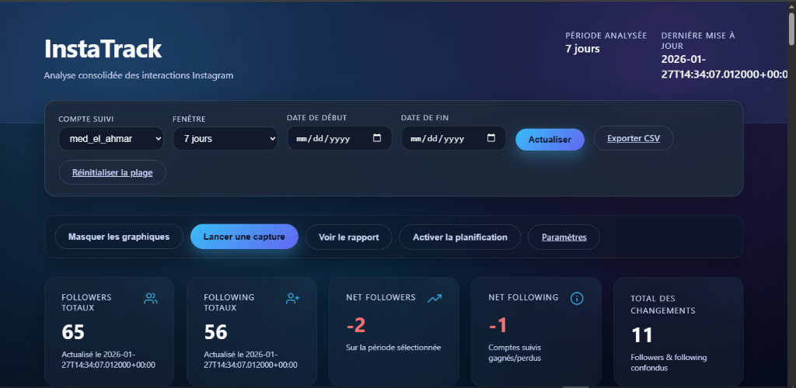
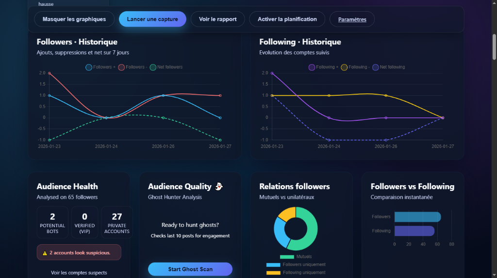

# 📸 InstaTrack


**Your personal dashboard for tracking your Instagram audience.**
InstaTrack monitors your followers, detects unfollows, identifies ghost followers, and helps you understand who really engages with your content.



---

## 🚀 Quick Start

Want to get started properly? Follow these 3 steps.

### 1. Installation
Clone the repo and install dependencies (Python 3.10+ required).

```bash
git clone https://github.com/mohammedelahmar/InstaTrack.git
cd InstaTrack
python -m venv .venv
# Windows:
.venv\Scripts\activate
# Mac/Linux:
source .venv/bin/activate

pip install -r requirements.txt
```

### 2. Configuration (`.env`)
Copy `.env.example` to `.env` and fill in the basics:

```ini
# .env
TARGET_ACCOUNTS=["your_main_account"]
INSTAGRAM_USERNAME=your_secondary_account
INSTAGRAM_PASSWORD=password
# Recommended: add INSTAGRAM_SESSIONID to avoid blocks
```

> **Tip**: Run the verification script to make sure everything is ready!
> ```bash
> python verify_setup.py
> ```

### 3. Launch 🏁
Start the dashboard:

```bash
python main.py web
```
Open your browser at **[http://127.0.0.1:5000](http://127.0.0.1:5000)**.

---

## ✨ Key Features



- **Ghost Hunter 👻**: Identify inactive followers who never like your posts (New!).
- **Unfollow Tracking 📉**: See who unfollowed you since yesterday.
- **Relationship Badges**: "Follows you", "Does not follow back", "Mutual".
- **AI Assistant (Gemini)**: Ask natural questions ("Who are my new followers this week?").
- **Visual Dashboard**: Clear charts, dark mode, CSV export.

## 🛠️ Advanced Usage

### CLI Modes
InstaTrack can also be used via command line:

```bash
# Manual follower snapshot
python main.py run

# Generate text report for the last 7 days
python main.py report --days 7

# Schedule daily automatic collection
python main.py schedule
```

### Tests
To verify the application works correctly (for developers):
See the [`tests/`](tests/README.md) folder for details.

```bash
python -m pytest
```

---

## ❓ FAQ & Troubleshooting

**Q: App is stuck on "Scanning..."?**
A: If you have many followers, the scan can take time. The new version uses a background task (async) to avoid timeouts. Please wait or refresh.

**Q: Instagram connection error?**
A: Instagram sometimes blocks automated connections. Use `INSTAGRAM_SESSIONID` in `.env` (retrievable via browser dev tools) to bypass password authentication.

---

*Made with ❤️ for the open-source community.*
